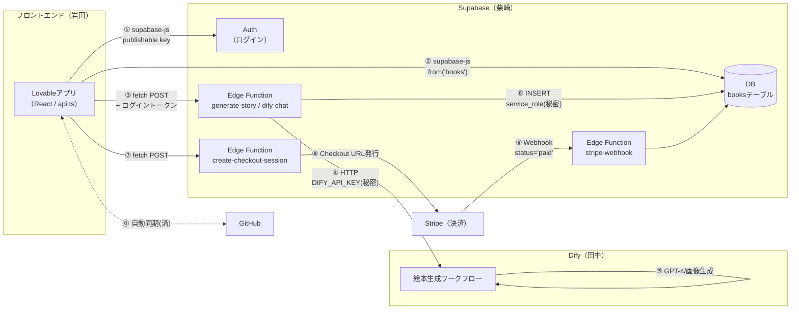

# DreamStories 接続マップ（3人共通の配線図）

岩田（フロントエンド）・柴崎（バックエンド）・田中（AIエンジン）の
**「どのツールのどこと、どこを、どの機能でつなぐか」** を1枚にまとめたものです。
接続作業の前にこのページを見れば、自分の担当と受け渡し物がわかります。

> インタフェースの正（リクエスト/レスポンスのJSON形）はフロントの
> [`src/lib/api.ts`](./src/lib/api.ts) に型として定義済み（資料第8章準拠）。
> 迷ったらこのファイルを見てください。

---

## 1. 全体図



**大原則**：フロントは「Supabaseとだけ」話す。**DifyとStripeの秘密キーは絶対にフロントに置かない**（Edge Functionの中だけ）。

---

## 2. 接続一覧（番号は図と対応）

| # | つなぐもの | 方式・機能 | 使う鍵 | 主担当 | 時期 | 状態 |
|---|---|---|---|---|---|---|
| ⓪ | Lovable ⇄ GitHub | リポジトリ自動同期 | GitHub App | 岩田 | - | ✅ 済 |
| ① | フロント → Supabase Auth | `supabase-js`（Google/メールログイン） | publishable key（公開OK） | 岩田 | - | ✅ 済 |
| ② | フロント → books テーブル | `supabase.from('books')` で SELECT | publishable key ＋ **RLS** | 柴崎(テーブル/RLS)・岩田(コード) | Week 6 | ⬜ |
| ③ | フロント → Edge Function | `fetch` POST（`generate-story`/`dify-chat`） | ログイントークン(Bearer) | 岩田(呼ぶ)・柴崎(作る) | Week 5 | ⬜ |
| ④ | Edge Function → Dify | HTTP（Dify API） | **DIFY_API_KEY**（EF Secretsのみ） | 柴崎 | Week 5 | ⬜ |
| ⑤ | Dify → GPT-4/画像モデル | Difyワークフロー内のモデル設定 | OpenAI等のキー（Dify内のみ） | 田中 | Week 5 | ⬜ |
| ⑥ | Edge Function → books INSERT | 生成結果をDBへ保存 | **service_role key**（EFのみ） | 柴崎 | Week 5-6 | ⬜ |
| ⑦⑧ | フロント → EF → Stripe | Checkout URL発行 → リダイレクト | **STRIPE_SECRET_KEY**（EFのみ） | 柴崎(EF)・岩田(画面) | Week 7 | ⬜ |
| ⑨ | Stripe → Webhook EF → DB | 決済完了で `status='paid'` に更新 | Webhook署名シークレット | 柴崎 | Week 7 | ⬜ |

---

## 3. それぞれの視点から

### 👤 岩田（フロントエンド）から見ると
- **触る場所**：`src/lib/api.ts` **だけ**（画面コードは修正不要の設計済み）
- **やること**：`API_BASE` にEdge FunctionのURLを設定し、各関数の `--- MOCK ---` ブロックを `fetch` に差し替える
- **柴崎さんからもらうもの**：Edge FunctionのURL（例 `https://usbzfxmwdqrwrzlykqiw.supabase.co/functions/v1`）と、各Functionの完成連絡
- **渡すもの**：`api.ts` の型定義（＝フロントが期待するJSONの形。これが仕様書）

### 👤 柴崎（バックエンド）から見ると
- **触る場所**：Supabaseダッシュボード（Table Editor / Edge Functions / Secrets）
- **やること**：
  1. `books` テーブル作成＋RLSポリシー（Week 6の前倒し推奨）
  2. Edge Function `generate-story`（＋`dify-chat`）作成。**入出力は `api.ts` の型に合わせる**
  3. Secretsに `DIFY_API_KEY` を登録（田中さんから受領）
  4. Week 7：`create-checkout-session`・`stripe-webhook` 作成、Stripeキー登録
- **田中さんからもらうもの**：DifyのAPIエンドポイントURLとAPIキー、出力JSONの形
- **岩田さんに渡すもの**：Edge FunctionのURL

### 👤 田中（AIエンジン）から見ると
- **触る場所**：Difyだけ（Supabaseやフロントは触らない）
- **やること**：
  1. 絵本生成ワークフロー作成（入力：`child_name / age / interests / theme / language`）
  2. 出力JSONを合意形式に：`{ title, pages: [{ page_number, text, image_url }] }`
  3. APIキーを発行して**柴崎さんにだけ**渡す（チャットに貼らない・フロントに渡さない）
- **岩田さんからもらうもの**：品質フィードバック（Week 9-10）、RAGファイル（japan_events.txt 等）

---

## 4. 鍵の置き場所ルール（事故防止・最重要）

| 鍵 | 置いてよい場所 | 置いてはいけない場所 |
|---|---|---|
| Supabase publishable key | フロントのコード（公開前提の鍵） | - |
| Supabase service_role key | Edge Function Secrets | ❌ フロント・GitHub・チャット |
| DIFY_API_KEY | Edge Function Secrets | ❌ フロント・GitHub・チャット |
| STRIPE_SECRET_KEY / Webhook secret | Edge Function Secrets | ❌ フロント・GitHub・チャット |
| OpenAI等のモデルキー | Difyの設定画面内 | ❌ それ以外すべて |

---

## 5. つなぐ順番（おすすめ）

```
1. 柴崎: booksテーブル＋RLS（15分）        ← 何にも依存しない
2. 田中: Difyワークフロー＋APIキー発行      ← 1と並行可
3. 柴崎: Edge Function generate-story      ← 1,2ができたら
4. 岩田: api.ts差し替え（各5-10分）         ← 3ができたら
5. 3人: エンドツーエンドテスト（資料 Week5 Day5）
6. Week 7: Stripe（⑦⑧⑨）
```

---
*更新日: 2026-07-20 ／ 変更があればこのファイルを更新して共有してください*
